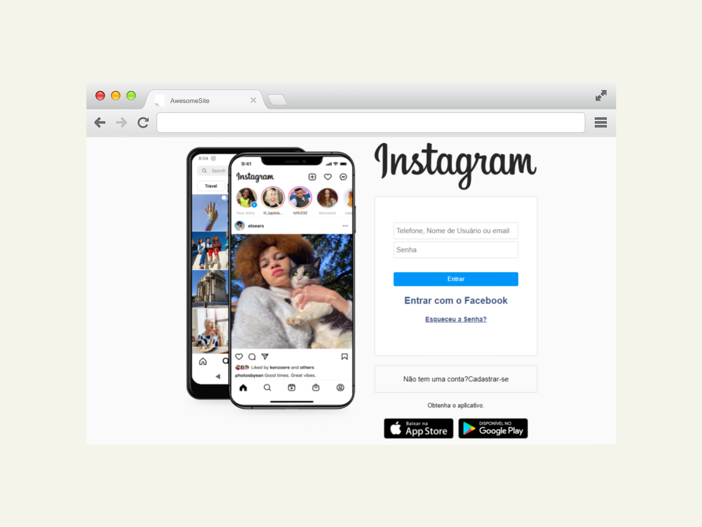

# Clone_Login-Page_Instagram

<h1 align="center"> Clone - Página de Login do Instagram </h1>

 
 

<h3 align="center">Projeto de clonagem da página de login do Instagram.</h3>
<h4 align="center">Baseada originalmente em uma estrutura para versão desktop, a página reúne aplicações de fundamentos desenvolvidos em HTML, CSS e JavaScript. 
Página desenvolvida como projeto de pesquisa e aplicação dos fundamentos aprendidos em ambiente de aula.</h4>

 

 
 
<h2 align="center">Resultado:</h2>

<label> Versão Desktop</label>

<label> Versão Mobile</label>

 

<h2 align="center">Tecnologias utilizadas no Projeto:</h2>

 

 

 

  
 

<h2 align="center">Fase do Projeto:</h2>

 <b>Status do Projeto:</b> Concluido :heavy_check_mark:

